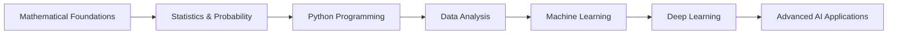

  
# Hello World! I'm Mohammad Febryan Khamim 👋
### Mathematics Student • Machine Learning Enthusiast • Python Developer

---

## 🧮 About Me

I'm a **Mathematics Undergraduate student** at **Institut Teknologi Sepuluh Nopember (ITS)**, diving deep into the fascinating world of **Machine Learning** and **Python Programming**. I believe that mathematics is the language of the universe, and I'm excited to use it to solve real-world problems through data science and AI.

### 🎯 Current Focus
**Bridging Mathematical Theory with Practical Machine Learning Applications**

## 🚀 What I'm Currently Up To

- 📚 **Studying**: Advanced Mathematics at ITS
- 🤖 **Learning**: Machine Learning algorithms and deep learning frameworks
- 🐍 **Coding**: Python for data science and ML applications
- 📊 **Exploring**: Data visualization and statistical analysis
- 🎓 **Building**: Academic and personal projects combining math and ML

## 🛠️ Tech Stack & Tools

### Programming Languages

### Data Science & ML

### Data Visualization

### Tools & Environment

## 🎓 Academic Journey

| 🏫 Institution | 📚 Department | 🎯 Focus Areas |
|:---:|:---:|:---:|
| **Institut Teknologi Sepuluh Nopember (ITS)** | Mathematics | Applied Mathematics, Statistics, Data Science |

## 🌟 Learning Roadmap

## 🤝 Let's Connect!

I'm always excited to discuss mathematics, machine learning, or collaborate on interesting projects! Feel free to reach out:

## 💭 Philosophy

*"Mountains are there to be climbed, aren't they?"*
- Ole Gunnar Solksjaer

---

⭐ **Feel free to star any repositories you find interesting!** ⭐

